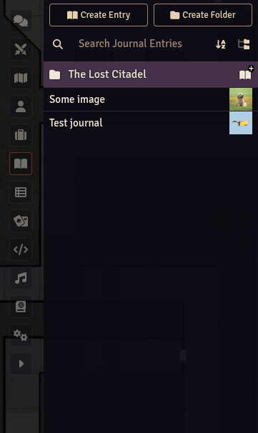

# Journal Thumbnails

A Foundry VTT Module that adds Thumbnails to Journal Entries based on the image of the Journal Entry.

## Installation

You can manually install the module by following these steps:

1. Inside Foundry, select the Game Modules tab in the Configuration and Setup menu.
2. Click the Install Module button and enter the following URL: `https://github.com/samulopez/foundryvtt-journal-thumbnail/releases/latest/download/module.json`

3. Click Install and wait for installation to complete.
4. Once installed, enable the module in your world by navigating to the Manage Modules section and checking the box next to "Journal Thumbnails".
